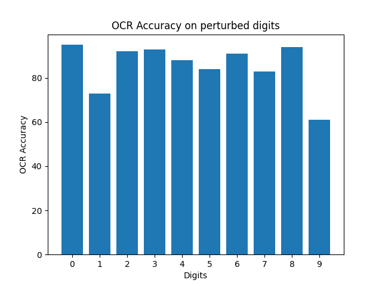

# OCR Accuracy Evaluation for Perturbed Digits

This Python script evaluates the accuracy of an Optical Character Recognition (OCR) model on perturbed digit images and generates a bar plot to visualize the accuracy for each digit.

## Prerequisites
All the packages can be found in requirements.txt file
Before running the script, make sure you have all the dependencies
You can install these dependencies using pip:
```bash
pip install -r requrements.txt
```
OCR model used is built by me in a different project you can find the details [here](https://github.com/saitejramu/handwritten_digits_classifier).


## Usage of the script
You can adjust the value of n in [dataset prep code](prepare_dataset.py) to change sample size

Run the below code to see the results
```bash
python main.py
```
After running the code you can see two directories created:
- [MNIST digits](digits)
- [Digits with added noise](digits_noised) 



In the plot on the right you can see the OCR Accuracy on perturbed Digits.
- Our perturbations include straight lines
- Accuracy on digits with no lines in it greater than 90% like 0, 3, 6, 8.
- Accuracy on digits which have line as a significant feature has dropped to less than 70% like 1 and 9